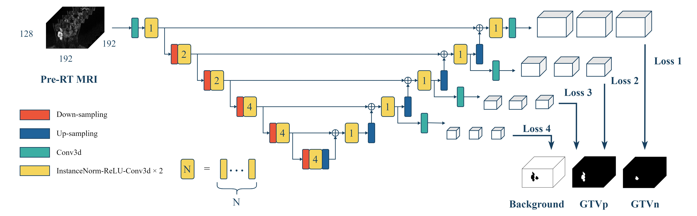
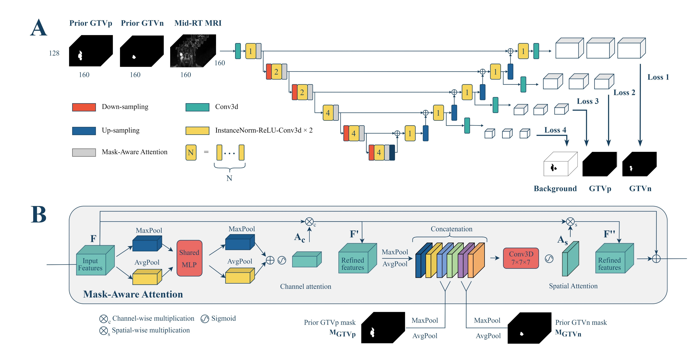
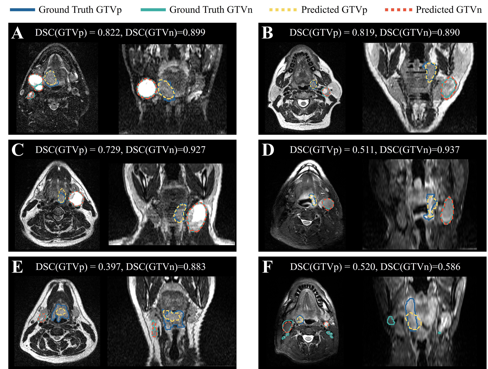
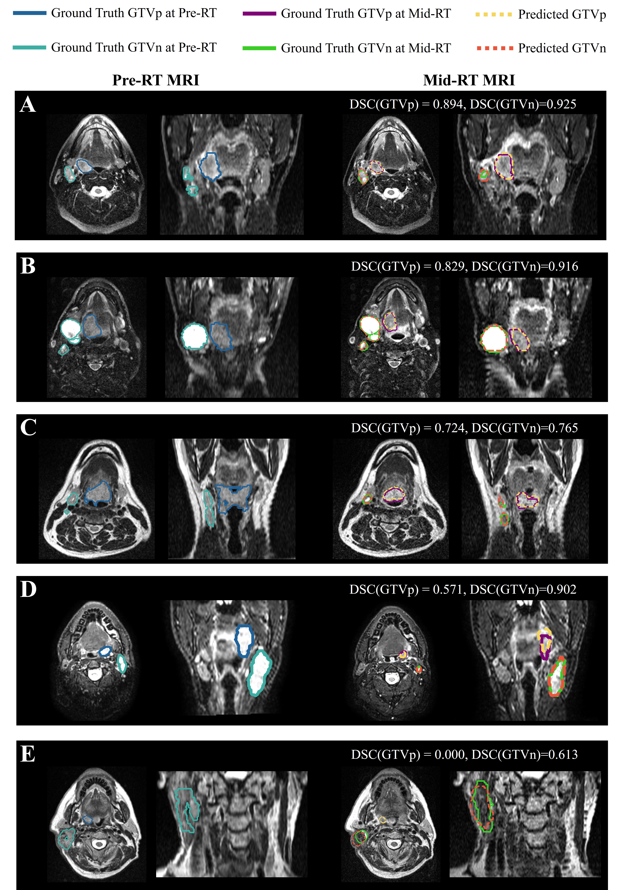

# 🎯 Deep Learning for Longitudinal Gross Tumor Volume Segmentation in MRI-Guided Adaptive Radiotherapy 🎯

 


## 🚀 Overview
Accurate segmentation of gross tumor volume (GTV) is crucial for effective MRI-guided adaptive radiotherapy (MRgART) in head and neck cancer. Manual segmentation is labor-intensive and susceptible to interobserver variability. This project aims to address these challenges by leveraging **deep learning (DL)** models to automatically delineate GTVs on both **pre-radiotherapy (pre-RT)** and **mid-radiotherapy (mid-RT)** MRI scans. 

We present a series of DL models for longitudinal GTV segmentation, offering potential to streamline radiation oncology workflows in ART.

> **The code in this repository is provided to ensure the reproducibility of our submission to the [MICAAI HNTS-MRG 2024 grand challenge](https://hntsmrg24.grand-challenge.org/overview/).** 


## Key Features
- **Pre-Radiotherapy (Pre-RT) GTV Segmentation (Task 1)**:  
  The DL models trained on combined pre-RT and mid-RT MRI datasets, yielding improved accuracy on hold-out test sets compared to models trained solely on pre-RT data.
  
- **Mid-Radiotherapy (Mid-RT) GTV Segmentation (Task 2)**:  
  The DL models integrating prior information from pre-RT scans can significantly improve the performance. We also introduced **mask-aware attention modules** to leverage pre-RT GTV masks in mid-RT segmentation. 

- **Ensemble Approach**:  
  Utilized an ensemble of 10 models for both tasks to improve robustness and overall performance. (Our model weights can be downloaded below)

## 📊 Results and Performance
   In the final testing phase: 
- **Pre-Radiotherapy (Task 1)**:
  - Average **DSCagg**: 0.794
  - **Primary GTV (GTVp)** DSC: 0.745
  - **Metastatic Lymph Nodes (GTVn)** DSC: 0.844

- **Mid-Radiotherapy (Task 2)**:
  - Average **DSCagg**: xxx
  - **GTVp** DSC: xxx
  - **GTVn** DSC: xxx
    
## Model Architectures and Visualizations

### Task 1: Pre-Radiotherapy Segmentation



### Task 2: Mid-Radiotherapy Segmentation with Mask-Aware Attention




## 💡 Example Use Cases

### Segmentation of GTVs in MRI Scans:
- **Example 1**: Pre-RT GTV segmentation
  
  
- **Example 2**: Mid-RT GTV segmentation
  

---

## 🛠 Installation

To install and run this project, you can use the pre-configured **Docker** container for easy setup. The Docker image is hosted on Docker Hub.

### Steps:

1. **Clone the repository**:
   ```bash
   git clone https://github.com/xtie97/HNTS-MRG24-UWLAIR.git
   cd HNTS-MRG24-UWLAIR
   ```
2. **Pull the Docker image from Docker Hub**:
   ```bash
   docker pull xtie97/monai_wb
   ```

3. **Run the Docker container**:
   ```bash
   docker run -it --rm -v $(pwd):/workspace xtie97/monai_wb
   ```
  - This command mounts your current project directory ($(pwd)) to the /workspace folder in the container for seamless access to your code.
  - Use -it for interactive mode and --rm to remove the container once you are done.


## ⚙️ Usage
Once inside the Docker container, follow the instructions below to train models for both Task 1 and Task 2.
### Task 1: Pre-RT Training
1. Navigate to the **Task1_preRT** folder:
```bash
cd Task1_preRT
```
2. Open and modify the **configs/hyper_parameters.yaml** file to adjust the training parameters:
   - The parameters in this YAML file are the same as those used in our final submission to Task 1.
   - Make sure to update the paths for your data root and data list.
3. Start training by running the following command:
```bash
python run.py
```
4. If you want to run inference, please change the following in the **configs/hyper_parameters.yaml** file:
 ```bash
infer: {enabled: true, ckpt_name: $@ckpt_path + '/' + 'model.pt', output_path: $@bundle_root
    + '/prediction_' + @infer#data_list_key + '_fold0', data_list_key: testing}
``` 
### Task 2: Mid-RT Training
1. Navigate to the **Task2_midRT** folder:
```bash
cd Task2_midRT
```
2. Modify the configs/hyper_parameters.yaml file:
 - Similar to Task 1, the parameters in this YAML file are the same as those used in our final submission to Task 2.
 - Update the paths for your data root and data list.
3. Start training by running the following command:
```bash
python run.py
``` 


## Model Weights:
We also provide all the models used in our final submission for reproducibility. You can download the pre-trained models via the following link:
  - [Dropbox](https://www.dropbox.com/scl/fo/eb5wrng0hxi6lmycsxiyf/ADATxiQ-1DqD_ILW-Snef8U?rlkey=xugmzfs22um6orvxzrnloervl&st=5dccg8qd&dl=0)


## 🙏 Acknowledgements
We acknowledge the organizers of the HNTS-MRG 24 Challenge for releasing high-quality, well-annotated data and for holding such a great challenge to advance the field of image-guided adaptive radiotherapy. We also thank the Center for High Throughput Computing (CHTC) at University of Wisconsin-Madison for providing GPU resources. 

Our code was adapted from the Auto3dseg pipeline in [MONAI](https://github.com/Project-MONAI/MONAI).

## UW LAIR Team Contributors
[Xin Tie](https://www.linkedin.com/in/xintie8254b6157/), 
[Weijie Chen](https://www.linkedin.com/in/winstonchen2017/), 
[Zachary Huemann](https://www.linkedin.com/in/zach-huemann/), 
[Brayden Schott](https://www.linkedin.com/in/brayden-schott-04693b109/), 
[Nuohao Liu](https://www.linkedin.com/in/nuohao-liu/), 
[Tyler Bradshaw](https://radiology.wisc.edu/profile/tyler-bradshaw-1400/) (PI)
